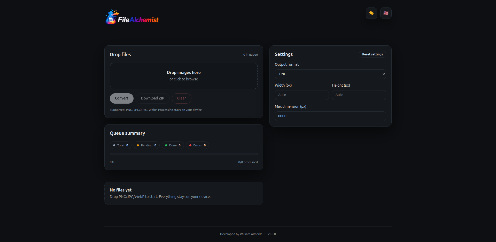

# FileAlchemist

[](https://vitejs.dev/)
[](https://react.dev/)
[](https://www.typescriptlang.org/)
[](https://tailwindcss.com/)
[](https://stuk.github.io/jszip/)

<!-- Screenshot placeholder: replace the path below with your image -->


## Overview
FileAlchemist is a client-side image converter that runs entirely in the browser. Users can drop or select PNG/JPG/WebP files, choose an output format, adjust quality, optionally resize, and convert locally using the Canvas API. No uploads. No server processing. Files never leave the device.

## Features
- Input: PNG, JPG/JPEG, WebP
- Output: PNG, JPG/JPEG, WebP (runtime WebP support detection)
- Quality slider for JPG/WebP
- Optional resize with a max dimension cap
- Batch processing with a job queue (Web Worker)
- Individual downloads and ZIP download for all
- Responsive UI and light/dark theme
- English and Portuguese UI with auto-detection

## Privacy
All processing happens locally in the browser. Files are kept in memory only for the current session and never uploaded.

## Tech Stack
- Vite + React + TypeScript
- Tailwind CSS
- Canvas + `createImageBitmap()` with fallback to `HTMLImageElement`
- Web Worker for conversion jobs
- JSZip for ZIP downloads

## Architecture Notes
- Image decoding uses `createImageBitmap()` when available, with a safe fallback.
- Conversion runs in a Web Worker to avoid blocking the UI.
- Object URLs are revoked to avoid memory leaks.

## Getting Started
Install and run:

```bash
npm install
npm run dev
```

Build and preview:

```bash
npm run build
npm run preview
```

Run tests:

```bash
npm run test
```

## GitHub Pages
The Vite base path is set to `/FileAlchemist/` in `vite.config.ts` for GitHub Pages. Build the project and deploy the `dist/` folder using your preferred Pages workflow.

## License
MIT
